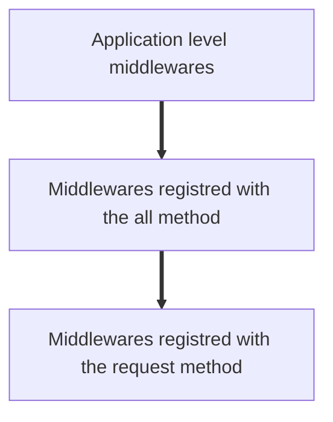
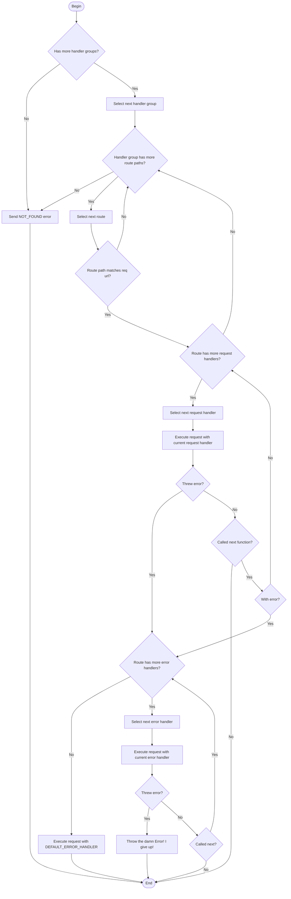

## Request handler groupes

**request handler groupes** refers to the stack:

```mermaid
flowchart TB
a[Application level middlewares]
b[Middlewares registred with the all method]
c[Middlewares registred with the request method]

a==>b==>c
```

## Request Routing

```mermaid
flowchart TB
  bg([Begin]) --> hg{Has more handler groups?}
  hg -- No -->nf
  hg -- Yes --> shg[Select next handler group]

  shg --> hghmrp{Handler group has more route paths?}
  hghmrp -- No --> nf
  hghmrp -- Yes --> snp[Select next route]

  snp --> rpmru{Route path matches req url?}
  rpmru -- No --> hghmrp
  rpmru -- Yes --> rhmrh{Route has more request handlers?}
  rhmrh -- No --> hghmrp
  rhmrh -- Yes --> snrh[Select next request handler]

  snrh --> erwcrh[Execute request with current request handler]
  erwcrh --> te{Threw error?}

  te -- Yes --> rhmeh
  te -- No --> cn{Called next function?}
  cn -- No --> ed

  cn -- Yes --> cnwe{With error?}
  cnwe -- No --> rhmrh
  cnwe -- Yes --> rhmeh{Route has more error handlers?}

  rhmeh -- No --> erwdeh[Execute request with DEFAULT_ERROR_HANDLER]
  erwdeh --> ed

  rhmeh -- Yes --> sneh[Select next error handler]
  sneh --> erwceh[Execute request with current error handler]
  erwceh --> ehte{Threw error?}

  ehte -- Yes --> ttde[Throw the damn Error! I give up!]
  ttde --> ed

  ehte -- No --> ehcn{Called next?}
  ehcn -- No --> ed

  ehcn -- Yes --> rhmeh


  nf[Send NOT_FOUND error]
  ed([End])
  nf --> ed
```
